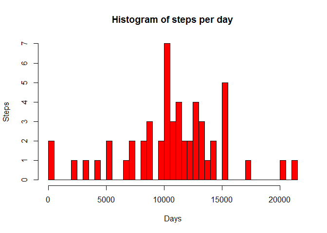
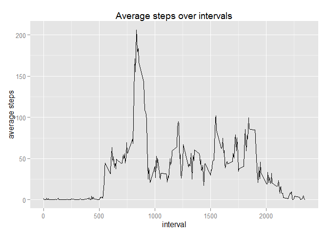
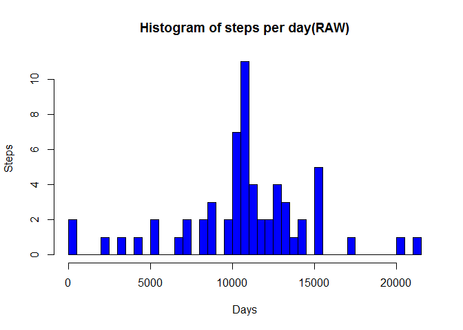
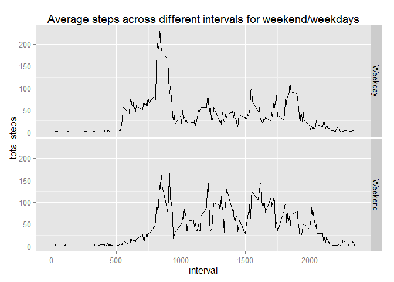

# Reproducible Research: Peer Assessment 1


## Loading and preprocessing the data

```r
library(ggplot2)
library(lubridate)
rawdata <- read.csv("activity.csv");
rawdata$date <- ymd(rawdata$date)
completedata <- rawdata[complete.cases(rawdata),]
```


## What is mean total number of steps taken per day?

```r
totalStepsPerDay <- aggregate(steps~date,completedata,sum)
totalDays = dim(totalStepsPerDay)[[1]];

#create histogram
hist(totalStepsPerDay$steps,breaks=totalDays,main="Histogram of steps per day",col="red",xlab="Days",ylab="Steps")
```

 

```r
##Mean and median per day
meansteps <- mean(totalStepsPerDay$steps)
mediansteps <- median(totalStepsPerDay$steps)
```
mean of total steps per day  1.0766189\times 10^{4}  
median of total steps per day  10765


## What is the average daily activity pattern?

```r
intervalBasedAvg <- aggregate(steps~interval,completedata,mean)
g <- ggplot(intervalBasedAvg,aes(x=interval,y=steps)) + geom_line();
g <- g + labs(x="interval",y="average steps")
g <- g + ggtitle("Average steps over intervals")
print(g)
```

 

```r
maxAvg <- max(intervalBasedAvg$steps)
```
The maximum average over intervals is 206.1698113

## Imputing missing values


```r
missingCount <- dim(rawdata)[[1]] - dim(completedata)[[1]]
```
Total rows with NAs 2304


```r
#Imputing average of interval value in the NAs of Steps
for(i in 1:nrow(rawdata))
{
  if(is.na(rawdata[i,1]))
  {
    avgSteps <- intervalBasedAvg[intervalBasedAvg["interval"]==rawdata[i,3],]$steps;
    
    rawdata[i,1] <- avgSteps
  }
 
  
}

#Aggregate raw data values now 
totalStepsPerDayRaw <- aggregate(steps~date,rawdata,sum)


#create histogram
hist(totalStepsPerDayRaw$steps,breaks=totalDays,main="Histogram of steps per day(RAW)",col="blue",xlab="Days",ylab="Steps")
```

 

```r
##Mean and median per day
meanstepsRaw <- mean(totalStepsPerDayRaw$steps)
medianstepsRaw <- median(totalStepsPerDayRaw$steps)
```
mean of total steps per day  1.0766189\times 10^{4}  
median of total steps per day  1.0766189\times 10^{4}  

Here we see that mean remains the same after imputed data , however median has changed.  

## Are there differences in activity patterns between weekdays and weekends?

```r
#Assign day types 
dayType <- vector();
for(i in 1:nrow(rawdata))
{
  dayName <- weekdays(rawdata[i,2]);

  if(dayName=="Saturday" | dayName=="Sunday")
  {

    dayType <- c(dayType,"Weekend");


  }
  else
  {

   dayType <- c(dayType,"Weekday");
  }

   
}
rawdata <- cbind(rawdata,dayType)

#change to factor type
rawdata$dayType <- as.factor(rawdata$dayType)

#create Aggregate
intervalBasedAggregate <- aggregate(steps~interval+dayType,rawdata,mean);


g <- ggplot(intervalBasedAggregate,aes(x=interval,y=steps)) + geom_line();
g <- g+ facet_grid(dayType~.);
g <- g + labs(x = "interval", y = "total steps")
g <- g + ggtitle("Average steps across different intervals for weekend/weekdays")
print(g)
```

 
